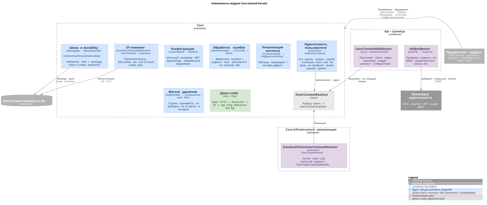

# Модуль Core - технический дизайн

Core - общее ядро (shared kernel): то, чем пользуются все предметные модули и что не принадлежит ни одному из них. Документ design-time: он описывает целевое устройство модуля и обоснования; справочник по факту - [docs/backend/core/](../../../backend/core/README.md).

## Что попадает в Core, а что нет

Граница проведена по одному признаку: в Core попадает то, у чего нет своего домена. Идентичность пользователя, коды ошибок, локализация текста, персистентность, шина сообщений - это не предметные понятия, а фундамент, на котором предметные модули стоят.

Обратное правило важнее: Core не знает о предметных модулях ничего. Он не ссылается на них, не перечисляет их и не содержит их типов. Как только в ядро попадает предметное понятие вроде "заказ" или "договор", оно перестаёт быть ядром и становится ещё одним модулем, от которого зависят все остальные, - худший вид связности, потому что он выглядит законным.

## Компоненты

**Идентичность пользователя.** `IUserContext` несёт `UserId` - значение claim `sub`. Прав здесь нет: роль привязана к области, а не к человеку целиком, и решение о доступе принимает обработчик предметного модуля по своим данным ([ADR-0023](../../../adr/0023-authentication-oidc.md)). Профиля здесь тоже нет: почту и имя стандарт отдаёт клиентскому приложению в ID-токене, и в токене доступа их может не быть вовсе.

**Шов разбора идентичности.** `IUserContextResolver` превращает набор claims в снимок. Порт нужен потому, что идентификатор доезжает до приложения не всегда одинаково: `sub` остаётся `sub`, только пока выключен `MapInboundClaims`, а иначе превращается в `ClaimTypes.NameIdentifier`. Реализация `StandardClaimsUserContextResolver` читает стандартный `sub` с запасным `ClaimTypes.NameIdentifier`, то есть работает на том, что выдают все провайдеры.

**Конфигурация.** Штатный конвейер .NET: `appsettings.json`, файл среды, переменные окружения (ими Aspire передаёт адреса контейнеров), `appsettings.Local.json` для личных оверрайдов. Типизированные `IOptions<T>` в потребителях. Внешнего источника настроек нет, поэтому нет и обёртки над секциями - они лежат в корне конфигурации, и строка подключения читается штатным `GetConnectionString`.

**Обработка ошибок.** `DomainException` с кодом и параметрами, каталог кодов `ErrorCodes`, `Result<T>` для фабрик переиспользуемых value object. Домен и валидаторы отдают код, текст резолвится один раз на границе Api ([ADR-0018](../../../adr/0018-domain-errors-codes-and-localization.md)).

**Локализация контента.** `LocalizationEntity` и хелпер `ConfigureLocalization` дают таблицу переводов на сущность: значение культуры по умолчанию дублируется инлайн и служит фолбэком, прочие культуры лежат строками ([ADR-0021](../../../adr/0021-entity-content-localization.md)). Механизм рассчитан на текст, который вводит пользователь: названия и описания, видимые на всех трёх языках интерфейса.

**Мягкое удаление.** Маркер `ISoftDeletable`, интерцептор сохранения и конвенция query-фильтра ([ADR-0022](../../../adr/0022-global-soft-delete.md)). Пока ни одна сущность маркер не реализует, механизм молчит. Он лежит в ядре заранее, потому что вводить мягкое удаление задним числом поверх накопленных данных дороже, чем держать три файла.

**EF-плюминг.** `DotnetVue3TemplateRuDbContext`, репозитории, миграции. Имена в схеме - snake_case, время - `timestamptz` ([ADR-0007](../../../adr/0007-postgresql.md)). Репозиторий владеет сохранением: `DbContext` для него - unit of work.

**Шина и durability.** Wolverine в режиме `Solo` с message store в отдельной схеме ([ADR-0014](../../../adr/0014-wolverine-durability-profile.md)). Синхронные операции идут через `InvokeAsync`, фоновые - через `PublishAsync`. На этом же фундаменте стоят операции по расписанию и отложенные сообщения.

**Демо-слайс.** `Ping` показывает Wolverine без БД, `Notes` - полный вертикальный срез HTTP -> Application -> Domain -> EF Core -> PostgreSQL, включая версионирование API, валидацию, коды ошибок и локализацию контента. Обе сущности временные и уходят с первым предметным модулем.

## Как заполняется идентичность

Цепочка на каждый запрос: `UseAuthentication` проверяет подпись токена по JWKS -> `UserContextMiddleware` прогоняет claims через резолвер и кладёт снимок в `HttpContext.Items` -> `UseAuthorization` -> контроллер снимает нужное из `IUserContext` и кладёт явным полем в команду -> обработчик получает всё, что ему нужно, из самой команды.

Два места в этой цепочке неочевидны, и оба легко сломать.

Контекст переносится через `HttpContext`, а не scoped-сервисом. Причина в Wolverine: он исполняет обработчик в отдельном DI-скоупе, куда экземпляр, созданный в middleware, не попадёт. `HttpContext` общий на весь запрос, поэтому переживает смену скоупа.

Обработчик не читает `IUserContext` сам, а получает идентичность полем команды ([ADR-0011](../../../adr/0011-api-application-boundary.md)). Это выглядит лишним шагом ровно до первого вызова вне HTTP-запроса: запуск по расписанию собирает ту же команду, и `HttpContext` там нет вовсе.

## Открытые вопросы

- **Локальная запись пользователя.** Сейчас цепочка доводится до `sub` из токена и на этом останавливается. Сущность пользователя появится вместе с первым предметным модулем и его моделью доступа - заводить её раньше значит строить половину модели, которую придётся переделать. `sub` записан как внешний ключ к этой будущей записи.
- **Гонка при первом входе.** Когда локальная запись появится, её создание будет идемпотентным get-or-create за уникальным ограничением по `sub`: две вкладки, открытые одновременно после входа, не должны породить двух пользователей.
- **Отправка почты.** Порт и адаптер почтового провайдера - первый реальный потребитель конвенций HTTP-клиента и durable-очереди. Ни того, ни другого в шаблоне ещё нет.
